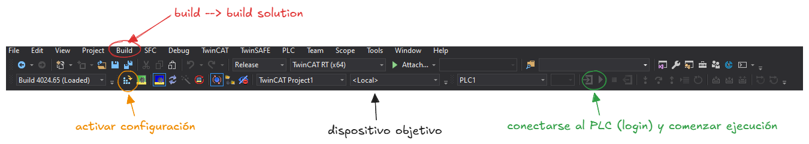

## Compilación, descarga y modo Online

### Compilar el proyecto

1. Ve a **Build → Build Solution** (o pulsa `Ctrl + Shift + B`).
2. Comprueba el panel **Error List** en la parte inferior. Si hay errores, corrígelos antes de continuar.
3. Si la compilación es correcta, aparecerá el mensaje `Build succeeded`.

### Seleccionar el dispositivo objetivo

Para ejecutar en el propio PC (sin hardware externo):

1. En la barra de herramientas de TwinCAT XAE, despliega el selector **Choose Target System**.
2. Selecciona `<Local>` para cargar el código en el runtime local.



### Activar la configuración y arrancar el runtime

1. Haz clic en **Activate Configuration** (icono de engranaje con flecha) o ve a **TwinCAT → Activate Configuration**.
2. Aparecerá un diálogo preguntando si deseas activar la configuración → **Yes**.
3. Otro diálogo preguntará si deseas reiniciar TwinCAT en Run Mode → **Yes**.
4. El icono de TwinCAT en la barra de tareas cambiará a **verde** (Run Mode).

> ⚠️ _En el caso de que al activar la configuración, TwinCAT informe que no es posible su activación debido al uso de la máquina virtual Hyper-V, es posible solucionar este problema de la siguiente manera. Primero es importante entender que aunque estemos utilizando TwinCAT en nuesto sistema operativo global, windows depende de Hyper-V para la correcta ejecución del Windows Subsystem for Linux (WSL) y Docker. Debemos por tanto anular la ejecución en segundo plano de Hyper-V. Para ello, abriremos PowerShell como administrador y ejectuaremos la siguiente línea de código:_
>
>```bcdedit /set hypervisorlaunchtype off``` 
>
>_Una vez desactivada Hyper-V, debemos reiniciar nuestro ordenador y el problema debería haber sido solucionado._ 
>_Para reactivar Hyper-V (en caso de que se necesite para usar WSL o Docker), ejecutaremos de la misma manera:_
>
>```bcdedit /set hypervisorlaunchtype auto```


### Conectarse al PLC (Login)

1. En el Solution Explorer, expande el proyecto PLC y haz doble clic en el programa **MAIN**.
2. Ve a **PLC → Login** (o `Alt + F8`). Se solicitará descargar el programa si hay cambios.
3. Confirma la descarga.
4. Una vez conectado, arranca la ejecución con **PLC → Start** (`F5`).