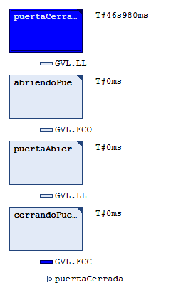
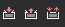

## Depuración en modo Online

Cuando el programa está en ejecución y estás conectado al PLC (_login_), el editor SFC muestra el estado en tiempo real:

- Las **etapas activas** se resaltan en **azul**.
- Si hay varias ramas paralelas, la rama en ejecución se muestra en **rojo**.
- Junto a cada etapa se puede ver el tiempo que lleva activa (si está configurada la supervisión de tiempo).

> 
*La etapa activa se muestra en azul* 

### Forzar variables (Force / Write)

En modo Online puedes modificar el valor de las variables para probar el comportamiento:

1. Abre la ventana de variables (clic derecho sobre una variable → **Add Watch**) o escribe el nombre en la zona de declaración.
2. Selecciona el valor que deseas para la variable en la columna de **Prepared Value**.
3. Pulsa `Ctrl + F7` o el botón de **Write** (escribe el valor en la siguiente evaluación del ciclo), o bien `F7` o el boton de **Force** (mantiene el valor forzado incluso si el programa intentara cambiarlo).

> 
*Botones de Force, Unforce, y Write* 

### Puntos de ruptura (Breakpoints)

Puedes colocar un **breakpoint** en una etapa SFC:

1. Haz clic derecho sobre la etapa → **Toggle Breakpoint**, o usa el menú **Online → Toggle Breakpoint**.
2. La etapa se marcará en **azul claro**.
3. Cuando el flujo llegue a esa etapa, la ejecución se detendrá y podrás inspeccionar el estado de las variables.

### Step Over en SFC

Con `F10` (**Step Over**), puedes avanzar el flujo de ejecución etapa a etapa cuando estás parado en un breakpoint. Esto es especialmente útil para verificar que la secuencia se comporta como esperabas.